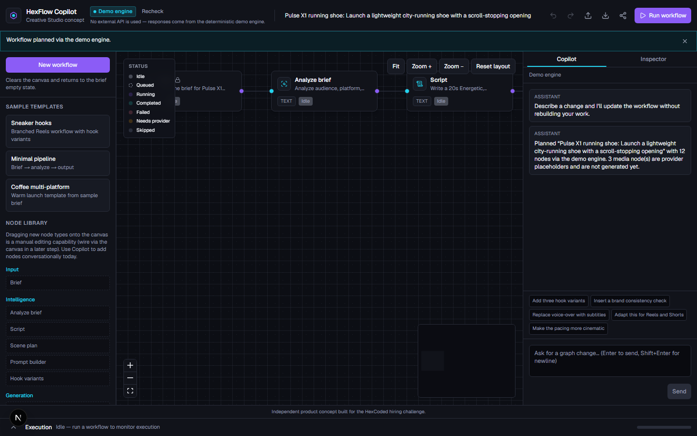
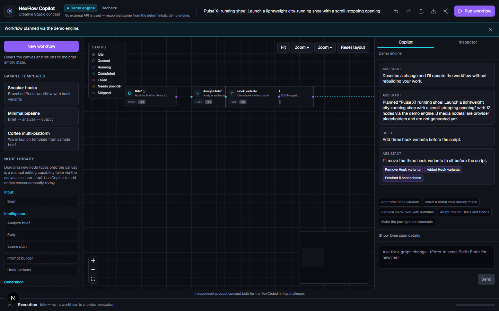
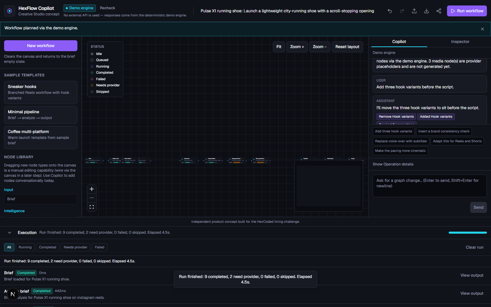
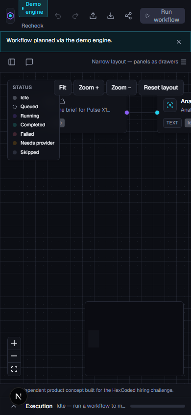
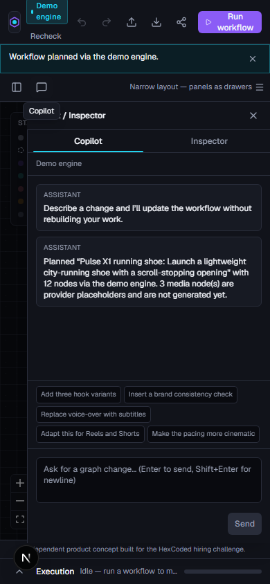
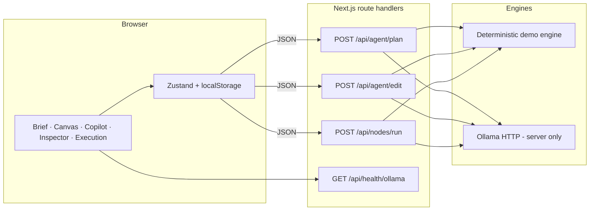

# HexFlow Copilot

**Turn creative intent into executable workflows.**

A Creative Studio concept for HexCoded: describe a short-form campaign, get an editable node graph, refine it in chat, and run every step with honest status — including clear “needs provider” labels where media generation is not wired.

> Independent product concept built for the HexCoded hiring challenge. Not affiliated with or employed by HexCoded. Not a production product.

---

## Screenshots

### Desktop — planned workflow (Demo engine)



### Desktop — Copilot edit (hooks before script)



### Desktop — execution strip



### Narrow — planned graph + Copilot drawer





More captures (brief, export, persistence, share URL, inspector outputs) live under [`docs/screenshots/`](docs/screenshots/).

---

## Why this should exist in HexCoded

HexCoded’s Creative Studio direction is about turning briefs into production systems — not one-off chat answers. Teams still bounce between docs, prompts, and tools when they need a **shared, editable, runnable** plan.

**Product hypothesis:** conversational control over a node canvas reduces workflow setup friction. Talking (“add three hooks,” “swap voice-over for subtitles”) should mutate a validated DAG, not dump a new opaque document.

HexFlow is a focused prototype of that loop: brief → DAG → chat edits → execute → inspect — with a public deterministic engine and optional local Ollama using the **same** contracts.

---

## What the prototype demonstrates

- Creative brief → Zod-validated workflow **DAG** on a React Flow canvas  
- Copilot chat that returns **graph operations** applied server-side (never a blind full-graph overwrite)  
- Node execution with timings, filters, retries, and inspector outputs  
- Honest media placeholders (`simulated: true` / **Needs provider**) — **no real image or video generation**  
- Dual AI modes: interactive **demo engine** (public) and local **Ollama** (same APIs, no external API keys)  
- Export / import / share-hash, undo, persistence in `localStorage` only  
- Desktop-first shell with a usable narrow layout  

This is a hiring / portfolio prototype, not production-ready software.

---

## Architecture



- **Browser:** presentation, orchestration, persistence. Never holds `OLLAMA_BASE_URL`.  
- **Server:** Zod validation, mode resolution, operation apply + DAG checks, sanitized errors.  
- **Demo engine:** deterministic and interactive (real plan/edit/run paths), not a mocked screenshot.  
- **Ollama:** optional local LLM via server `fetch` only; structured outputs validated like demo.

See also `docs/ARCHITECTURE.md` and `docs/PRODUCT_SPEC.md`.

---

## Ollama mode versus public demo mode

| | **Demo engine** | **Ollama (local)** |
|--|-----------------|-------------------|
| **When** | `AI_MODE=demo` (required on Vercel) | `AI_MODE=ollama` or reachable `auto` |
| **Plan / edit / text nodes** | Deterministic interactive engine | Local model via Ollama `/api/chat` |
| **Media nodes** | Simulated / needs provider | Same honesty — still no real generation |
| **API keys** | None | None (local Ollama only) |
| **UI** | **Demo engine** badge | May show connected model when safe |

`AI_MODE=auto` uses Ollama when reachable; otherwise falls back to demo for connection / timeout / missing-model only — not for schema or programming errors.

Local Ollama exercises the **same** validated planner/editor contracts as demo, without any external API key.

---

## Local setup

Prerequisites: Node.js 20+, npm, and (for Ollama mode) [Ollama](https://ollama.com).

```bash
npm install
cp .env.example .env.local
ollama serve
ollama pull qwen3:4b
npm run dev
```

Open [http://localhost:3000](http://localhost:3000).

### Windows

`cp` may be unavailable in PowerShell / CMD. Copy the env file manually:

```powershell
Copy-Item .env.example .env.local
```

Or in File Explorer: copy `.env.example` → rename to `.env.local`.

Then edit `.env.local` (for a local Ollama recording set `AI_MODE=ollama`), start Ollama, pull the model, and run `npm run dev`.

---

## Environment variables

**None of these are secrets.** This prototype uses no API keys, tokens, or paid providers.

| Variable | Purpose | Typical values |
|----------|---------|----------------|
| `AI_MODE` | Engine selection | `demo` · `ollama` · `auto` |
| `OLLAMA_BASE_URL` | Server-only Ollama base URL | `http://127.0.0.1:11434` |
| `OLLAMA_MODEL` | Model name for chat/structured output | `qwen3:4b` |
| `OLLAMA_TIMEOUT_MS` | Server fetch timeout | `120000` |
| `OLLAMA_KEEP_ALIVE` | Ollama keep-alive hint | `10m` |

`OLLAMA_*` is never exposed via `NEXT_PUBLIC_*` and is never accepted from request bodies.

---

## Test commands

```bash
npm run lint
npm run typecheck
npm run test
npm run build
npm run test:e2e
```

First Playwright run may need Chromium:

```bash
npx playwright install chromium
```

Latest verified results (see `docs/QUALITY_REPORT.md`): Vitest **158** passed; Playwright smoke **1** passed; lint, typecheck, and build passed.

Supporting docs: `docs/DEMO_SCRIPT.md` (recording), `docs/SUBMISSION_CHECKLIST.md` (ship check).

---

## Deployment to Vercel

Vercel cannot reach Ollama on a laptop. Public deploys **must** use the demo engine:

1. Import the GitHub repository into Vercel.  
2. Set Environment Variable: `AI_MODE` = `demo` (Production / Preview).  
3. Deploy.  
4. Confirm the UI shows **Demo engine** and that plan → edit → run works with an empty browser profile (no localStorage required for the happy path).

Do not set `AI_MODE=ollama` on Vercel.

Live URL (fill in after deploy): `YOUR_LIVE_URL`  
Repository URL (fill in after publish): `YOUR_REPO_URL`

---

## Product decisions and trade-offs

- **Operations over wholesale replace** — edits are validated op lists applied on the server so the graph stays a DAG.  
- **Demo engine is real software** — same routes and schemas as Ollama; public evaluators get a complete interactive path.  
- **Honesty over spectacle** — media nodes never pretend a provider rendered assets.  
- **No auth / DB / paid APIs** — keeps the prototype auditable and key-free.  
- **Desktop-first** — narrow layout remains operable; not a mobile-native studio.  
- **In-memory rate limits** — soft abuse reduction only; not multi-instance production limiting.

---

## Known limitations

- Not production-ready (no auth, multi-user sync, or distributed rate limits).  
- No real image, video, voice, or music generation.  
- Share URLs are client-side compressed hashes with size caps; large graphs use JSON export.  
- Persistence is browser `localStorage` only.  
- Hosted deploys depend on `AI_MODE=demo`.

---

## What I would build next with the HexCoded team

1. Real provider adapters behind the existing `needs_provider` boundary, with the same honesty labels until connected.  
2. Collaborative review of a workflow version (comments on nodes, shareable read-only views).  
3. Deeper brand / platform validators fed by studio guidelines, still as first-class graph nodes.  
4. Hardening toward multi-tenant deployment (auth, durable store, real rate limits) without changing the conversational-DAG hypothesis.

---

## Independent-concept disclaimer

HexFlow Copilot is an **independent product concept** built for the HexCoded hiring challenge. It does not imply affiliation with, endorsement by, or employment at HexCoded. All trademarks belong to their owners.
